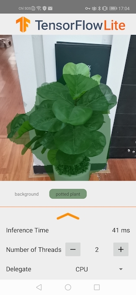

# image_segmentation - HDMI-IN Image Segmentation Application

## Overview

The image_segmentation application captures video input from the HDMI-IN source of the Nexcom VMC320 vehicle mount computer and performs real-time image segmentation to identify and classify objects within the captured images. This demo showcases the capability of performing object recognition and segmentation using advanced neural network techniques.

## Features

- **HDMI-IN Video Capture:** Captures video input from an HDMI source.
- **Real-time Segmentation:** Applies image segmentation algorithms to identify and classify objects in real-time.
- **Object Recognition:** Highlights and labels detected objects within the video feed.

## Screenshot

## Getting Started

1. Clone the repository: `git clone https://github.com/KevincyCheng/VMC320.Android.git`
2. Navigate to the image_segmentation directory: `cd VMC320.Android/image_segmentation`
3. Open the project in Android Studio.
4. Build and run the application on your VMC320 device.

## Usage

- Connect an HDMI source to the VMC320 device.
- Launch the image_segmentation app to start capturing video.
- Observe the real-time object segmentation and classification displayed on the screen.
- Interact with the app to adjust segmentation parameters if available.

## Contributing

Contributions are welcome! Please fork the repository and submit pull requests for any improvements or bug fixes.

